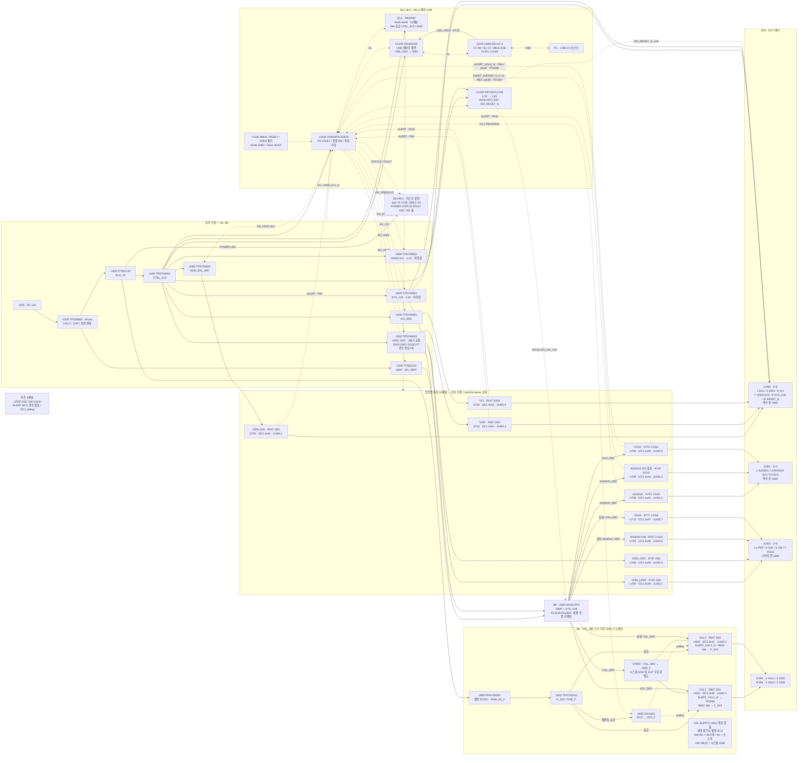

# R2 전체 블록도 — ALERT 수정 반영

기준: R2_REPAIRED_006. VGL1·2는 절연 I2C2 polling 유지.

```mermaid
flowchart LR
  subgraph PWR["입력·전원 — B1~B6"]
    J100["J100 · DC 12V"] --> U100["U100 TPS26600 · eFuse<br/>UVLO / OVP / 전류 제한"]
    U100 --> U200["U200 TPS62130<br/>AUX_5V"]
    U100 --> U300["U300 TPS62130<br/>VBAT · EN_VBAT"]
    U200 --> U400["U400 TPS7A9001<br/>CTRL_3V3"]
    U400 --> U500["U500 TPS7A9001<br/>VDDI_DIG_SRC"]
    U400 --> U520["U520 TPS7A9001<br/>VDDI_SRC · 3분기 공통<br/>R525 DNP / R526 FIT<br/>션트 전단 FB"]
    U400 --> U540["U540 TPS7A9001<br/>VCI_SRC"]
    U400 --> U600["U600 TPS7A9001<br/>VDDIO1V2 · 1.2V · 비측정"]
    U400 --> U620["U620 TPS7A9001<br/>SYS_1V8 · 1.8V · 비측정"]
  end
  U300 --> MOS["B9 · U900 MOSCATO<br/>VBAT + SYS_1V8<br/>PLACEHOLDER · 실물 핀맵 미확정"]
  U620 --> MOS
  subgraph MEAS["양전압 측정 10채널 — 션트 직렬 / INA228 Kelvin 감지"]
    C1["VDDI_DIG · R507 20Ω<br/>U700 · I2C1 0x40 · J1400.1"]
    C2["VDDI · R527 20Ω<br/>U710 · I2C1 0x41 · J1400.3"]
    C3["VDDI_LPDP · R787 20Ω<br/>U780 · I2C1 0x48 · J1403.1"]
    C4["VDDI_OSC · R797 20Ω<br/>U790 · I2C1 0x49 · J1403.3"]
    C5["VCI · R547 100Ω<br/>U720 · I2C1 0x42 · J1400.5"]
    C6["AVDDH1 · R737 3.01Ω<br/>U730 · I2C1 0x43 · J1401.1"]
    C7["AVDDH2 S/O 합산 · R747 3.01Ω<br/>U740 · I2C1 0x44 · J1401.3"]
    C8["AVDDH2 GM · R767 3.01Ω<br/>U760 · I2C1 0x46 · J1403.5"]
    C9["VGH1 · R757 3.01Ω<br/>U750 · I2C1 0x45 · J1401.5"]
    C10["VGH2 · R777 3.01Ω<br/>U770 · I2C1 0x47 · J1403.7"]
  end
  U500 --> C1
  U520 --> C2
  U520 --> C3
  U520 --> C4
  U540 --> C5
  MOS -->|AVDDH1_SRC| C6
  MOS -->|AVDDH2_SRC| C7
  MOS -->|동일 AVDDH2_SRC| C8
  MOS -->|VGH_SRC| C9
  MOS -->|동일 VGH_SRC| C10
  subgraph FLOAT["B8 · VGL 공통 소스 기준 GND_F 도메인"]
    U800["U800 RFM-0505S<br/>절연 DC/DC · RAW_5V_F"] --> U810["U810 TPS7A1633<br/>F_3V3 / GND_F"]
    U830["U830 ISO1641<br/>I2C2 ↔ I2C2_F"]
    NT800["NT800 · VGL_SRC ↔ GND_F<br/>시스템 GND 및 DUT 후단과 별도"]
    C11["VGL1 · R807 20Ω<br/>U820 · I2C2 0x40 · J1402.1<br/>ALERT_VGL1_N → TP1069<br/>R822 10k → F_3V3"]
    C12["VGL2 · R847 20Ω<br/>U840 · I2C2 0x41 · J1404.1<br/>ALERT_VGL2_N · R842 10k → F_3V3"]
    U810 -->|공급| C11
    U810 -->|공급| C12
    U810 -->|절연측 공급| U830
    U830 -. polling .-> C11
    U830 -. polling .-> C12
    NT800 --- C11
    NT800 --- C12
    VNOTE["VGL ALERT는 MCU 경로 없음<br/>상태 읽기는 절연 I2C2<br/>INA IN+ = DUT측 / IN- = 소스측<br/>INA VBUS = 시스템 GND"]
  end
  U200 --> U800
  MOS -->|VGL_SRC| C11
  MOS -->|동일 VGL_SRC| C12
  MOS -->|VGL_SRC| NT800
  subgraph DUT["B14 · DUT 헤더"]
    JD["J1400 · 2×6<br/>1 DIG / 3 VDDI / 5 VCI<br/>7 VDDIO1V2 / 9 SYS_1V8 / 11 RESET_N<br/>짝수 핀 GND"]
    JA["J1401 · 2×3<br/>1 AVDDH1 / 3 AVDDH2 S/O / 5 VGH1<br/>짝수 핀 GND"]
    JE["J1403 · 2×6<br/>1 LPDP / 3 OSC / 5 GM / 7 VGH2<br/>나머지 핀 GND"]
    JN["J1402 · 1 VGL1 / 2 GND<br/>J1404 · 1 VGL2 / 2 GND"]
  end
  C1 --> JD
  C2 --> JD
  C5 --> JD
  U600 --> JD
  U620 --> JD
  C6 --> JA
  C7 --> JA
  C9 --> JA
  C3 --> JE
  C4 --> JE
  C8 --> JE
  C10 --> JE
  C11 --> JN
  C12 --> JN
  subgraph CTL["B11~B13 · MCU·제어·USB"]
    MCU["U1100 STM32F072CBT6<br/>PG·FAULT / 전원 EN / 측정 수집"]
    BUS["I2C1 · PB6/PB7<br/>0x40~0x49 · 10채널<br/>INA 공급 CTRL_3V3 / GND"]
    SHIFT["U1300 SN74AXC2T45<br/>3.3V → 1.8V<br/>MOSCATO_EN / DDI_RESET_N"]
    DEBUG["Y1100 8MHz / RESET / VDDA 필터<br/>J1100 SWD / J1101 BOOT"]
    USB["U1200 ADuM4160<br/>USB 데이터 절연<br/>USB_GND ↔ GND"]
    JACK["J1200 USB4105-GF-A<br/>CC Rd / D±·CC·VBUS ESD<br/>U1201~U1204"]
    PC["PC · USB 2.0 호스트"]
    MCU -.-> BUS
    MCU -.-> SHIFT
    DEBUG -.-> MCU
    MCU <-. D± .-> USB
    USB <-. D± .-> JACK
    JACK <-. USB .-> PC
    JACK -->|USB_VBUS · PC측| USB
  end
  U400 --> MCU
  U400 --> BUS
  U400 --> USB
  U400 --> SHIFT
  U620 --> SHIFT
  BUS -. 공통 측정 버스 .-> MEAS
  MCU -. I2C2 PB10/PB11 .-> U830
  SHIFT -. MOSCATO_EN_1V8 .-> MOS
  SHIFT -. DDI_RESET_N_1V8 .-> JD
  MCU -. EN_VBAT .-> U300
  MCU -. EN_VDDI_DIG .-> U500
  MCU -. EN_VDDI .-> U520
  MCU -. EN_VCI .-> U540
  MCU -. EN_VDDIO1V2 .-> U600
  MCU -. EN_SYS_1V8 .-> U620
  PWR -. PG / PWR_FLT_N .-> MCU
  C1 -. ALERT · PA0 .-> MCU
  C2 -. ALERT · PA9 .-> MCU
  C5 -. ALERT · PA10 .-> MCU
  C6 -. ALERT · PA15 .-> MCU
  C7 -. "ALERT_AVDDH2_S_O_N · PB3 / pin39 · TP1067" .-> MCU
  C9 -. "ALERT_VGH1_N · PB4 / pin40 · TP1068" .-> MCU
  POLL["추가 4채널 LPDP·OSC·GM·VGH2<br/>ALERT MCU 경로 없음 / I2C1 polling"]
  TP["B10·B15 · 테스트·상태<br/>B10 TP 70개 / 서비스 TP<br/>POWER·STATUS·FAULT LED / M3 홀"]
  MCU -. STATUS / FAULT .-> TP
  U200 -->|POWER LED| TP
```
